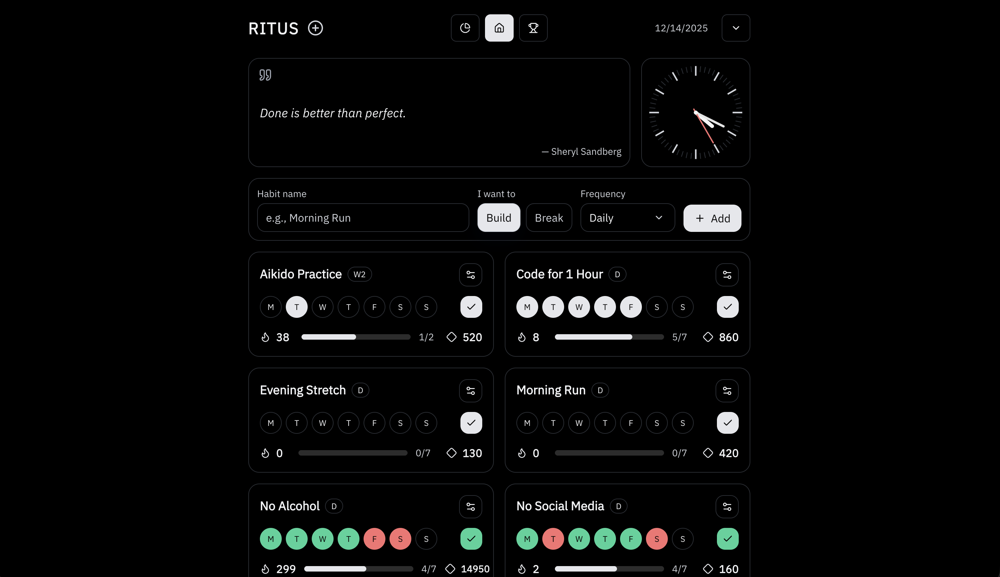
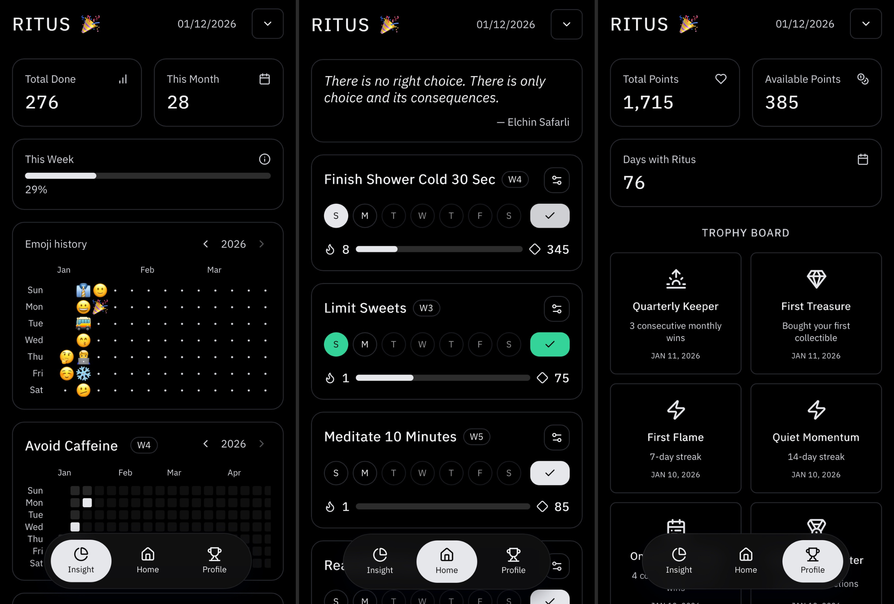
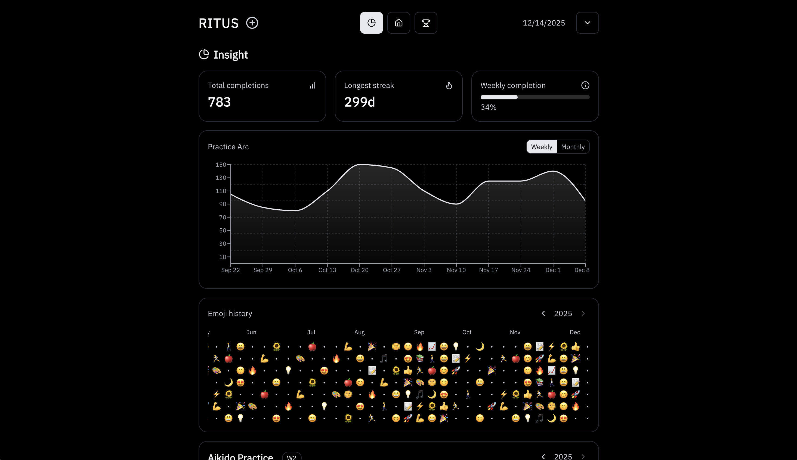
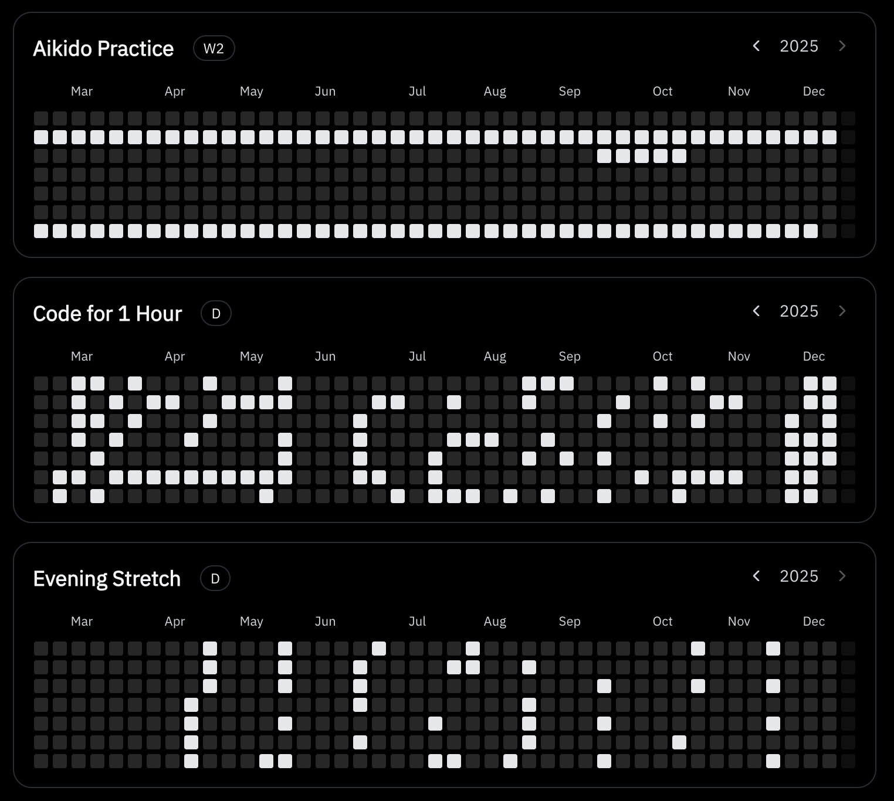
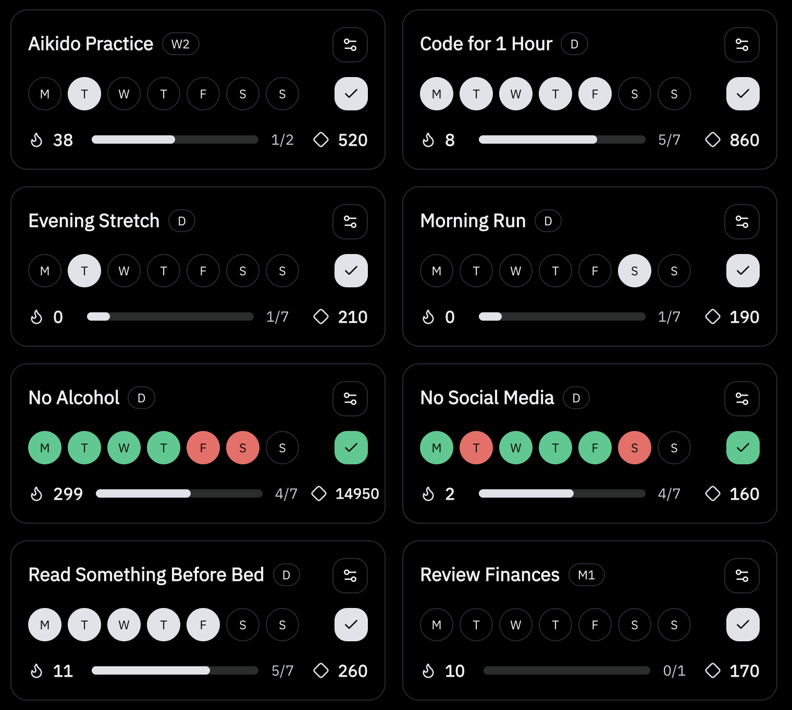
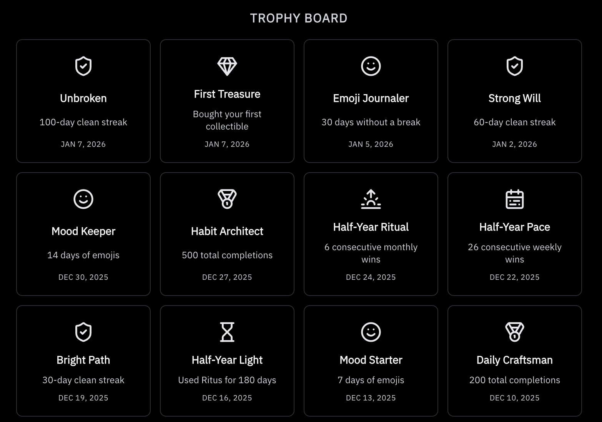
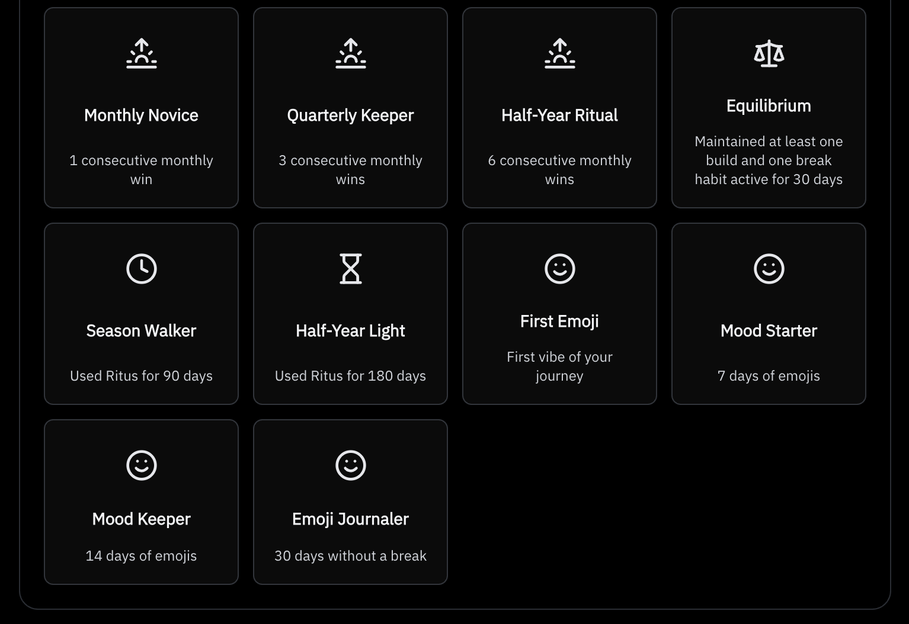
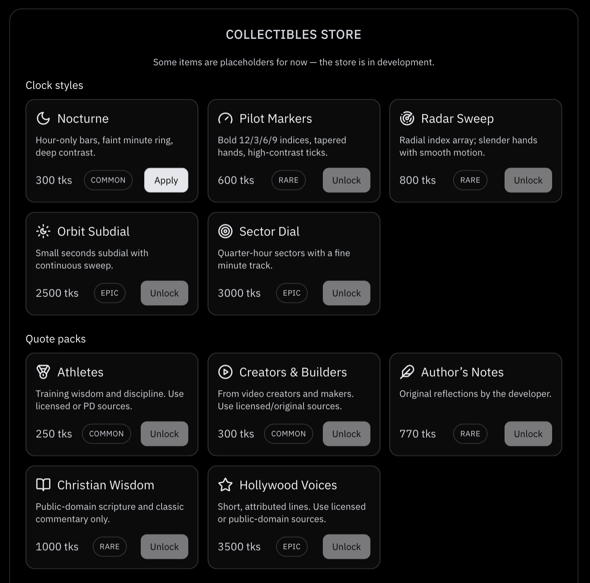
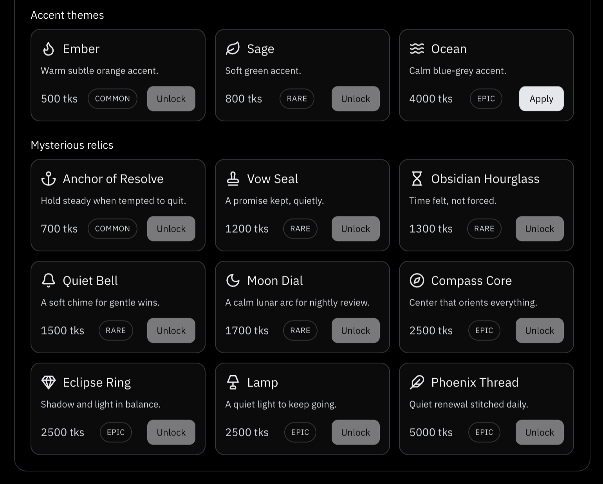

# Ritus — Minimal, Local‑Only Habit Tracker

A calm habit tracker focused on simplicity and privacy. Track daily/weekly/monthly habits, streaks, and milestones. Earn tokens to unlock cosmetic collectibles — all stored locally in your browser.

## Screenshots

#### Desktop



#### Mobile



<details>
<summary>Pages (Insight &amp; Profile)</summary>




</details>

<details>
<summary>Stats Cards &amp; Grid View</summary>





</details>

<details>
<summary>Trophy Board</summary>





</details>

<details>
<summary>Collectibles Store</summary>





</details>

## Features

### Habit tracking

- Create, edit, archive, and delete habits
- Frequencies: **daily**, **weekly**, **monthly**
- Modes: **Build** (do the habit) and **Break** (avoid the habit)
- Weekly/monthly habits support **numeric targets** (e.g., 3× per week)
- Fast logging via a weekday strip (Mon–Sun) and one‑tap “done” actions

### Insights

- Streaks and completion counts
- Practice Arc with weekly/monthly overview of earned XP
- Year grid view for completion history
- Year grid view for emoji history

### Progression (cosmetic)

- Earn **progress XP** (lifetime) and level up
- Earn **tokens** from completions and consistency bonuses
- Spend tokens in the **Collectibles Store** (cosmetic only)
  - Clock styles
  - Quote packs
  - Accent themes
  - Relics
- Unlock **trophies** for milestones (streaks, consistency, totals, etc.)

### Emoji of the day

- Curated “emoji of the day” + emoji picker
- Emoji history view for playful journaling context

### Data management & preferences

- Export / import your data as JSON (with merge/dedup summaries)
- Clear local data from Settings
- Theme: system / light / dark
- Date format: MM/DD or DD/MM
- Week start day: Sunday or Monday

## Privacy & data

- No login, no accounts
- No cloud sync
- No analytics
- Data is stored locally in your browser via a persisted Zustand store (`localStorage`)

> **Note on storage:** Ritus persists data in your browser via `localStorage`. It’s private (stays on your device) but not encrypted. Use **Export** to keep backups.

## Tech stack

- React 18 + TypeScript
- Vite
- Tailwind CSS
- Zustand (with `persist`)
- Framer Motion
- Recharts
- date-fns
- Lucide-react

## Getting started

```bash
pnpm install
pnpm run dev
```

Build + preview production:

```bash
pnpm run build
pnpm run preview
```

## Project structure

High-level layout:

- `src/`
  - `App.tsx`, `main.tsx` — app bootstrap and routing
  - `features/` — feature pages and page-level components
    - `home/` — habit list, add/edit flows, quick completion actions
    - `insight/` — stats + charts + history views
    - `profile/` — progression, trophies, collectibles store
    - `inspiration/` — inspiration/quote-related UI (feature page)
    - `compass/` — compass feature page
  - `shared/`
    - `store/` — Zustand store + persisted state (`store.ts`, `theme.ts`, defaults)
    - `types/` — canonical app types
    - `constants/` — collectibles, trophies, progression, emoji pools, suggestions
    - `utils/` — scoring, dates, data transfer (import/export), quotes, confetti
    - `components/` — reusable UI (header, modals, week strip, picker, etc.)
    - `theme/` — accent theme logic
- `public/` — icons, fonts, manifest, README screenshots
- `dev-dist/` — service worker artifacts (PWA)

### Persistence details

The app persists a partial snapshot of the Zustand store to `localStorage` under a single key. If you change persisted shapes, update the `partialize` configuration in `src/shared/store/store.ts` and consider adding migrations.

## Contributing

PRs are welcome.

- Keep changes small and focused
- Prefer adding or adjusting logic via store actions (single source of truth)
- If you touch reward rules or scoring, consider adding unit tests around the relevant utilities
- For quotes, ensure sources are public domain or properly licensed

## License

Original work by Kyle Brooks. See `LICENSE` and `NOTICE`.
